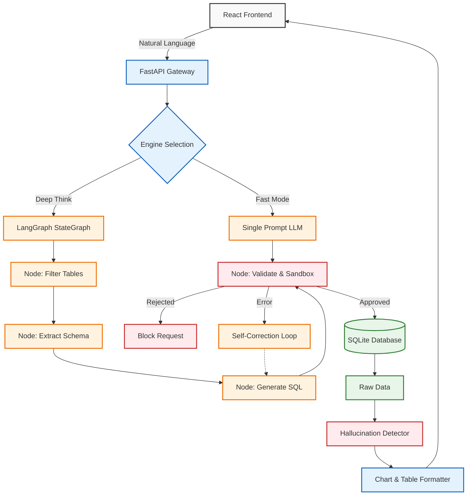
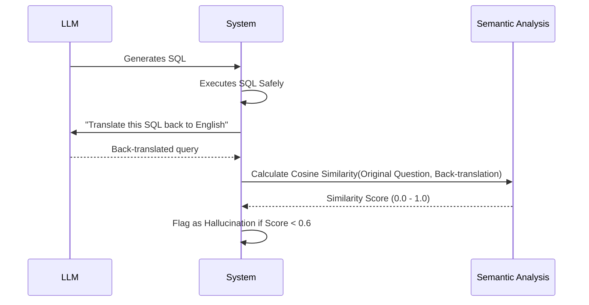

<div align="center">
  
  
  <br />
  
  <br />

  [](https://reactjs.org/)
  [](https://fastapi.tiangolo.com/)
  [](https://python.langchain.com/docs/langgraph)
  [](https://ai.google.dev/)
  <br />
  [](#)
  [](#)
  [](https://opensource.org/licenses/MIT)
  [](#)
</div>

---

## 🌟 Executive Overview

**SQL Sentinel** bridges the gap between natural language processing and mission-critical database operations. Designed for enterprise data teams, it allows non-technical users to query complex databases using everyday language, while enforcing strict, programmatic guardrails to guarantee system stability and security.

### 💡 Why this project exists
Text-to-SQL is fundamentally unsafe for production environments. LLMs frequently hallucinate schema details, generate malicious queries (like `DROP TABLE`), or construct unoptimized cross-joins that crash databases. SQL Sentinel solves this by wrapping state-of-the-art LLM generation inside an impenetrable execution sandbox with autonomous self-correction.

### 🎯 Key Highlights
- **Dual-Engine Processing:** Choose between sub-second `Fast Mode` for rapid exploration and `Deep Think Mode` for agentic, multi-step reasoning.
- **Self-Healing Architecture:** When the database rejects a query, the LangGraph agent intercepts the error and rewrites the SQL autonomously.
- **Zero-Trust Execution:** Queries are executed inside a `BEGIN...ROLLBACK` transactional wrapper, ensuring the database state is never mutated.

---

## 🏗️ Architecture

### Request Flow & Agent Topology



---

## 💻 Tech Stack

### Frontend
<a href="https://reactjs.org/" target="_blank"></a>
<a href="https://recharts.org/" target="_blank"></a>
<a href="https://tailwindcss.com/" target="_blank"></a>

### Backend
<a href="https://fastapi.tiangolo.com/" target="_blank"></a>
<a href="https://python.org" target="_blank"></a>
<a href="https://www.sqlite.org/index.html" target="_blank"></a>

### AI & Agents
<a href="https://python.langchain.com/docs/langgraph" target="_blank"></a>
<a href="https://ai.google.dev/" target="_blank"></a>
<a href="https://huggingface.co/" target="_blank"></a>

---

## 📂 Project Structure

```text
📦 SQL_Sentinel
 ┣ 📂 backend
 ┃ ┣ 📜 main.py                  # FastAPI entry point & API routes
 ┃ ┣ 📜 langgraph_agent.py       # Multi-agent Deep Think pipeline
 ┃ ┣ 📜 sql_generator.py         # LLM interaction & prompt engineering
 ┃ ┣ 📜 guardrails.py            # AST parsing, regex checks, and safe execution
 ┃ ┣ 📜 hallucination_detector.py # Confidence scoring & back-translation
 ┃ ┣ 📜 schema_extractor.py      # Database reflection & RAG integration
 ┃ ┣ 📜 vector_store.py          # Local semantic search for training context
 ┃ ┗ 📜 requirements.txt         # Python dependencies
 ┣ 📂 frontend
 ┃ ┣ 📂 src
 ┃ ┃ ┣ 📂 components
 ┃ ┃ ┃ ┣ 📜 ChatUI.js            # Main conversational interface
 ┃ ┃ ┃ ┗ 📜 Chart.js             # Dynamic Recharts rendering engine
 ┃ ┃ ┣ 📜 App.js                 # React root & state management
 ┃ ┃ ┗ 📜 index.css              # Global styles & Glassmorphism UI
 ┃ ┣ 📜 package.json             # Node dependencies
 ┃ ┗ 📜 tailwind.config.js       # Styling configuration
 ┣ 📜 .gitignore
 ┗ 📜 README.md
```

---

## ✨ Features

### ✅ Completed
- [x] **Fast Mode Engine:** Single-shot LLM prompt generation for sub-second responses.
- [x] **Deep Think Engine:** Multi-stage LangGraph workflow for table filtering, DDL extraction, and autonomous self-correction.
- [x] **Zero-Trust Execution Sandbox:** Wraps all DB interactions in a `ROLLBACK` transaction.
- [x] **Regex Guardrails:** Hard blocks for `DROP`, `DELETE`, `UPDATE`, `INSERT`, `TRUNCATE`, and missing `LIMIT` clauses.
- [x] **Hallucination Detection:** Translates SQL back to English and calculates semantic similarity to the original prompt.
- [x] **Dynamic Visualizations:** Automatically infers Chart.js configs (Bar, Line, Pie) based on data types.
- [x] **RAG Training UI:** Interface to teach the AI custom domain logic and SQL examples.

### 🚧 In Progress
- [ ] **Multi-Dialect Support:** Extending `execute_sql_safely` beyond SQLite to PostgreSQL and Snowflake.
- [ ] **Authentication Layer:** Integrating JWT and Role-Based Access Control (RBAC).

### 📌 Planned
- [ ] **Caching Layer:** Redis integration for frequently asked queries.
- [ ] **Semantic Caching:** Bypassing the LLM entirely if the vector distance of a new question matches a previously verified query.

---

## ⚙️ Installation & Setup

### Prerequisites
- Node.js (v18+)
- Python (v3.10+)
- Google Gemini API Key

### 1. Clone the Repository
```bash
git clone https://github.com/AyushGU12/SQL_Sentinel.git
cd SQL_Sentinel
```

### 2. Backend Initialization
```bash
cd backend
python -m venv venv

# Activate Virtual Environment
# Windows:
venv\Scripts\activate
# macOS/Linux:
source venv/bin/activate

pip install -r requirements.txt
```

### 3. Environment Configuration
Create a `.env` file in the `/backend` directory:
```ini
GEMINI_API_KEY="your_google_gemini_api_key"
```

### 4. Start the Application
**Terminal 1 (Backend):**
```bash
cd backend
python -m uvicorn main:app --port 8080
```

**Terminal 2 (Frontend):**
```bash
cd frontend
npm install
npm start
```
The application is now accessible at `http://localhost:3000`.

---

## 📡 API Documentation

### Base URL
`http://localhost:8080`

### Endpoints

| Method | Endpoint | Description |
|--------|----------|-------------|
| `POST` | `/v1/query` | Fast Mode SQL generation & execution. |
| `POST` | `/v1/query_graph` | Deep Think Mode (LangGraph) multi-step execution. |
| `GET`  | `/v1/schema` | Retrieve current database schema definitions. |
| `POST` | `/v1/context` | Add a new RAG training example (SQL or Text). |
| `GET`  | `/v1/context` | List all custom training contexts. |
| `GET`  | `/v1/history` | Retrieve query execution history and hallucination scores. |

<details>
<summary><strong>📝 Request Example (Deep Think Mode)</strong></summary>

```bash
curl -X POST http://localhost:8080/v1/query_graph \
  -H "Content-Type: application/json" \
  -d '{
    "question": "What are the top 5 highest selling artists?",
    "previous_sql": null
  }'
```
</details>

---

## 🧠 AI / ML Pipeline

### Vector Embeddings & RAG
SQL Sentinel utilizes HuggingFace's `all-MiniLM-L6-v2` embedding model to vectorize the database schema and user-provided training context. 

When a user asks a question:
1. The question is vectorized.
2. The vector store retrieves the top-k most relevant tables and prior custom SQL examples.
3. This highly specific context is injected into the LLM prompt, massively reducing token usage and hallucination rates compared to injecting the entire database DDL.

### Hallucination Verification Flow


---

## 🔒 Security Architecture

**SQL Sentinel operates under a Zero-Trust Database Policy.**

1. **Regex Pattern Blocking:** Any query containing `DROP`, `DELETE`, `UPDATE`, `INSERT`, `ALTER`, `TRUNCATE`, `GRANT`, `REVOKE`, or `EXEC` is immediately rejected at the AST/string level before it ever reaches the database driver.
2. **Infinite Loop Prevention:** The guardrail enforces a strict `LIMIT` clause requirement. If the LLM generates a query without one, it is blocked to prevent massive cartesian joins from exhausting RAM.
3. **Transaction Sandboxing:** The ultimate failsafe. `execute_sql_safely` opens a transaction, executes the read query, fetches up to 500 rows, and then **forces a rollback**. 

```python
# The ultimate safety net
conn.execute("BEGIN")
cursor.execute(sql)
rows = cursor.fetchmany(500)
conn.rollback() # Never commit. Ever.
```

---

## 📈 Performance & Scalability

* **Stateless Agents:** The LangGraph instances maintain state only for the lifecycle of a single request, allowing the backend to scale horizontally behind a load balancer without sticky sessions.
* **Vector Store In-Memory Caching:** The FAISS/Chroma underlying structures load into memory on startup, ensuring that RAG retrieval takes `< 10ms`.
* **Execution Throttling:** Queries are capped at `fetchmany(500)` rows to prevent serialization overhead and frontend rendering lag.

---

## 🤝 Contributing

We welcome contributions! Please follow our Git Flow:

1. Fork the repository.
2. Create a feature branch: `git checkout -b feature/amazing-feature`
3. Commit your changes following [Conventional Commits](https://www.conventionalcommits.org/).
4. Push to the branch: `git push origin feature/amazing-feature`
5. Open a Pull Request.

---

## 📄 License

This project is licensed under the **MIT License**. See the `LICENSE` file for details.

---

<div align="center">
  
  <br />
  <strong>Made with ❤️ for modern data teams.</strong>
  <br />
  <p>⭐ Star this repository if you found it useful!</p>
</div>

## Deployment
This project is configured for deployment with Docker and Google Cloud Run. See cloudbuild.yaml and deploy-cloudrun.yml for details.

## 🚀 Cloud Deployment Architecture

This project is fully optimized for cloud deployment with 100% parity to the local development environment. It supports a dual-architecture deployment model:

### 1. Platform Native (PaaS)
Pre-configured for zero-downtime deployment on platforms like Render, Vercel, or Firebase.
- Native configuration files (e.g., 
ender.yaml) are included for one-click deployments.
- Environment variables prioritize cloud APIs (Groq, Gemini, OpenAI) to ensure compatibility with free-tier memory limits.

### 2. Dockerized Containers
For isolated, infrastructure-agnostic deployment on VPS or Cloud Run.
- **Multi-stage Dockerfile**: Optimized for lightweight, fast builds.
- **docker-compose.yml**: Configured with strict health checks, network isolation, and unless-stopped restart policies.
- Automatically handles local dependencies and avoids local OOM crashes by prioritizing cloud inference APIs.

### 🔄 CI/CD Pipeline
Continuous Integration and Deployment is handled via GitHub Actions.
- Workflows are configured in .github/workflows/ to automatically test and deploy changes pushed to the main branch.
