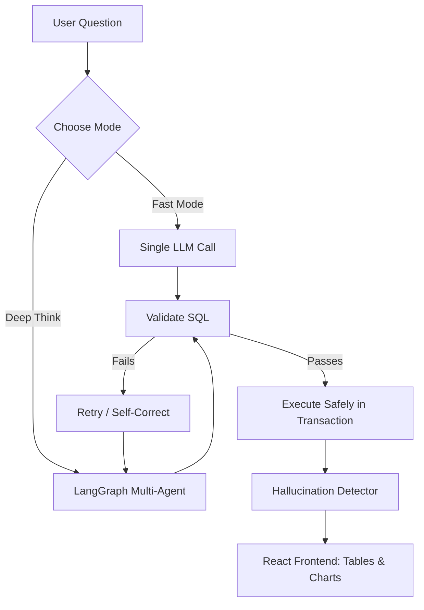

<div align="center">
  
  
  # SQL Sentinel 🛡️
  
  **Enterprise-Grade, Guardrail-Protected, Multi-Agent Text-to-SQL Engine.**

  [](https://reactjs.org/)
  [](https://fastapi.tiangolo.com/)
  [](https://python.langchain.com/docs/langgraph)
  [](https://ai.google.dev/)
  
  *Transform natural language into secure, validated SQL queries and visualize the results instantly.*
</div>

---

## 🌟 Overview

**SQL Sentinel** is not just another text-to-SQL wrapper. It is a highly resilient, enterprise-ready platform designed to safely query databases using natural language. It features a dual-engine architecture, built-in hallucination detection, dynamic chart rendering, and strict execution guardrails that ensure no rogue queries ever mutate your database.

Whether you need a blazing-fast answer or a deep, multi-step self-correcting analysis, SQL Sentinel has you covered.

## ✨ Core Features

### 🚀 Dual-Engine Architecture
* **⚡ Fast Mode (Single-Prompt):** Lightning-fast query generation for everyday data exploration. Merges your database schema and rules into a highly optimized prompt to return data and charts in 1-3 seconds.
* **🧠 Deep Think Mode (LangGraph):** A multi-agent StateGraph that breaks complex queries down into explicit steps. It filters tables, extracts precise DDL, generates SQL, and *self-corrects*. If the database throws an error, the agent routes back, analyzes the exact error, and rewrites the query—healing its own mistakes!

### 🛡️ Ironclad Guardrails
* **Safe Execution Environment:** Every query is wrapped in a `BEGIN` ... `ROLLBACK` transaction. Even if the LLM generates a `DROP TABLE` or `DELETE` command, your database remains completely untouched.
* **Syntax & Safety Validation:** Python-level regex guardrails aggressively block destructive keywords, prevent infinite cross-joins, and enforce `LIMIT` clauses to protect system memory.

### 🕵️‍♂️ Hallucination Detection & Confidence Scoring
Never blindly trust the LLM. SQL Sentinel features an advanced verification pipeline:
* **Back-Translation:** Translates the generated SQL *back* into English and compares it against the user's original question using Sentence Transformers.
* **Sanity Checking:** Analyzes the raw result rows (e.g., preventing empty datasets or unexpected columns) to generate a final composite confidence score (0.0 to 1.0).

### 📊 Dynamic Visualization
The AI doesn't just write SQL—it also recommends how to visualize it. The frontend dynamically renders **Bar Charts**, **Line Graphs**, and **Pie Charts** based on a strict `chart_config` generated alongside your data, complete with CSV and PNG export capabilities.

### 🧠 RAG Context Management
Teach the AI your business logic. A built-in UI allows you to add custom SQL examples and domain-specific documentation to a Vector Store, creating a bespoke knowledge base that the LLM references before every query.

---

## 🛠️ Technology Stack

**Frontend:**
* React.js
* Recharts (Dynamic Visualization)
* Axios (API Communication)
* CSS3 (Glassmorphism & Modern UI)

**Backend:**
* Python 3.10+
* FastAPI (High-performance API)
* LangGraph & LangChain (Agentic Workflows)
* Google Gemini (LLM Generation)
* HuggingFace `all-MiniLM-L6-v2` (Vector Embeddings)
* SQLite (Local Vector Store & Demo Database)

---

## 🚦 Getting Started

### 1. Clone the Repository
```bash
git clone https://github.com/AyushGU12/SQL_Sentinel.git
cd SQL_Sentinel
```

### 2. Backend Setup
```bash
cd backend

# Create a virtual environment
python -m venv venv
source venv/bin/activate  # On Windows use `venv\Scripts\activate`

# Install dependencies
pip install -r requirements.txt

# Create your environment variables
echo "GEMINI_API_KEY=your_api_key_here" > .env

# Start the FastAPI server
python -m uvicorn main:app --port 8080
```

### 3. Frontend Setup
```bash
cd frontend

# Install dependencies
npm install

# Start the development server
npm start
```
The application will launch at [http://localhost:3000](http://localhost:3000).

---

## 📖 Architecture Diagram



---

<div align="center">
  Built with ❤️ for modern data teams.
</div>
